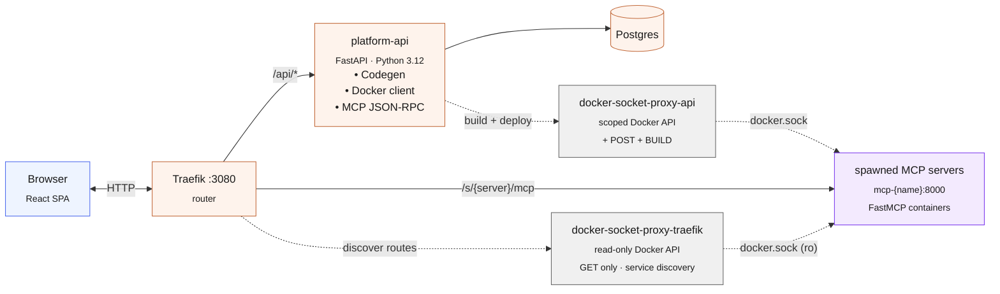
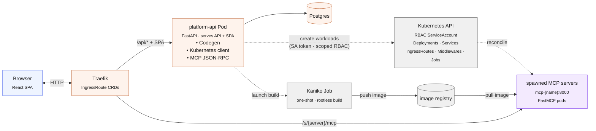

<div align="center">


# Roundhouse

**A self-hosted home for your [MCP](https://modelcontextprotocol.io) servers.**

Write a tool in the browser, hit deploy, and a containerized FastMCP server is
live at a stable URL — ready for Claude Desktop, Claude Code, or any MCP client.

[](https://roundhousemcp.com)
[](https://roundhousemcp.com/docs/)
[](https://fastapi.tiangolo.com)
[](https://vitejs.dev)
[](https://www.docker.com)
[](https://github.com/jlowin/fastmcp)

</div>

---

## Why Roundhouse?

Network engineers and developers have years of scripts and internal code that
belong behind MCP servers now that AI is running lead — but standing those
servers up shouldn't require learning MCP *and* DevOps in the same week.
Roundhouse turns "I wrote a tool" into "my team can use it from Claude":
define primitives in a form (or paste a `server.py`), and the platform
generates the code, builds the image, runs the container behind Traefik, and
hands you a stable, token-protected URL.

It also runs **entirely on your own hardware**. No cloud dependency, no
external services, no telemetry — which makes it a fit for Federal,
air-gapped, and restricted networks where hosted MCP platforms aren't an
option.

| | |
|---|---|
| 🛠 **Codegen + deploy** | Structured forms or raw Python → `server.py` + `Dockerfile` → running container behind Traefik. |
| 🌐 **Centralized URLs** | One stable URL per server, shared across your team. No tunnel hacks, no port juggling. |
| 🔐 **Auth on day one** | Scoped bearer tokens out of the box; per-primitive scope locks. |
| 📈 **Built-in observability** | Per-tool call counts, latency percentiles, live logs — no Prometheus, no Grafana. |
| 🐳 **Single host or Swarm** | `docker compose` on one box, or Swarm with scoped socket proxies. |

<div align="center">
<a href="https://roundhousemcp.com/docs/"><strong>📸 See the user guide for screenshots &amp; a full walkthrough →</strong></a>
</div>

---

## Quick start

> Requires **Docker** and **Docker Compose**. Runs from the published image —
> no clone, no build.

```bash
curl -O https://raw.githubusercontent.com/Karmatek-Consulting-LLC/roundhouse/main/docker-compose.yml
docker compose up -d
```

When the API logs print `Application startup complete`, open
**<http://localhost:3080>** and sign in with `admin@mcp.local` / `admin`.

## Connect Claude

Every deployed server gets a stable URL like
`http://localhost:3080/s/my-server/mcp`. Mint a token on the server's
**Auth** tab, then:

```bash
claude mcp add my-server \
  --url    http://localhost:3080/s/my-server/mcp \
  --header "Authorization: Bearer <token>"
```

Claude Desktop and other MCP clients work the same way — see
[Connecting clients](https://roundhousemcp.com/docs/#connecting-clients) in
the docs.

---

## Documentation

- **[roundhousemcp.com](https://roundhousemcp.com)** — what Roundhouse is and why.
- **[User guide](https://roundhousemcp.com/docs/)** — install, every editor
  surface, tokens, usage metrics, platform administration, configuration
  reference, and deployment modes.
- **[`docs/user-guide.md`](docs/user-guide.md)** — the same guide in the repo,
  for offline and air-gapped environments. The website version is generated
  from it (`node website/build-docs.mjs`).

---

## Architecture

### Docker — single host & Swarm



Traefik routes MCP clients **straight to the spawned container** — the
platform never proxies MCP traffic on the hot path. The platform-api only
speaks MCP internally, to power the *Test* buttons in the UI.

Neither Traefik nor platform-api touches the raw Docker socket in
production. Both go through scoped [`tecnativa/docker-socket-proxy`][dsp]
sidecars: **`docker-socket-proxy-traefik`** is read-only (GET-only — service
discovery, no `POST`/`BUILD`), while **`docker-socket-proxy-api`** additionally
allows `POST` + `BUILD` so the API can build images and create/manage
containers. This is the `docker-stack.yml` (Swarm) topology shown above; local
`docker-compose.yml` mounts `/var/run/docker.sock` directly for convenience.

[dsp]: https://github.com/Tecnativa/docker-socket-proxy

### Kubernetes



On Kubernetes there are **no socket-proxy sidecars** — the whole `docker.sock`
problem disappears. The platform-api talks to the cluster API with its own
`ServiceAccount` token, and a `Role`/`RoleBinding` scoped to the workloads
namespace bounds exactly what it may do (manage Deployments, Services,
`IngressRoute`/`Middleware`, and build Jobs). Images build in **unprivileged,
one-shot Kaniko Jobs** — no Docker daemon, no privileged container — then push
to your registry; spawned pods pull from it. Routing is native: the platform
writes a Traefik `IngressRoute` per server, so MCP clients still hit the spawned
pod directly. A single api image serves both `/api/*` and the React SPA (it
bundles the build), so there's no separate frontend workload. Deploy it with the
[Helm chart](deploy/helm/roundhouse).

**In the box:** FastAPI backend (Python 3.12) on the Docker socket ·
React + Vite frontend with an IDE-style editor · Postgres · Traefik front
door · Alembic migrations baked into startup.

---

## Development

The backend (`api/`) is FastAPI + SQLAlchemy; the frontend (`frontend/`) is
React + Vite. Clone the repo and use `docker-compose.dev.yml`, which builds
from source with hot-reload on `api/` and `frontend/`:

```bash
docker compose -f docker-compose.dev.yml up -d
docker compose -f docker-compose.dev.yml logs -f platform-api   # tail the API
docker compose -f docker-compose.dev.yml logs -f frontend       # tail the frontend

# Run the API outside Docker, pointed at the dockerized Postgres
cd api
python -m venv .venv && source .venv/bin/activate
pip install -e .
DB_HOST=localhost uvicorn app.main:app --reload
```

Configuration, deployment modes (single-host vs Swarm), and the
corporate-proxy CA workaround live in the
[configuration reference](https://roundhousemcp.com/docs/#configuration-reference).

---

## License

Roundhouse is licensed under the [Apache License 2.0](LICENSE).

---

<div align="center">
<sub>Built with care by <a href="https://karmatek.io">Karmatek</a>.<br/>Roundhouse is the home you wish your MCP servers had.</sub>
</div>
