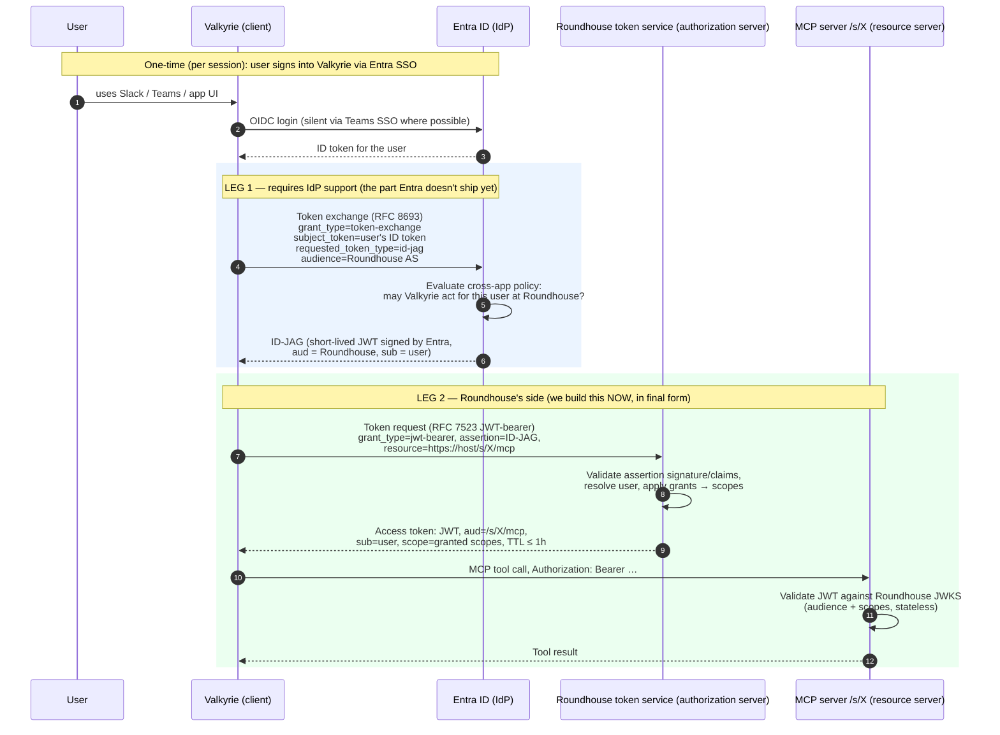
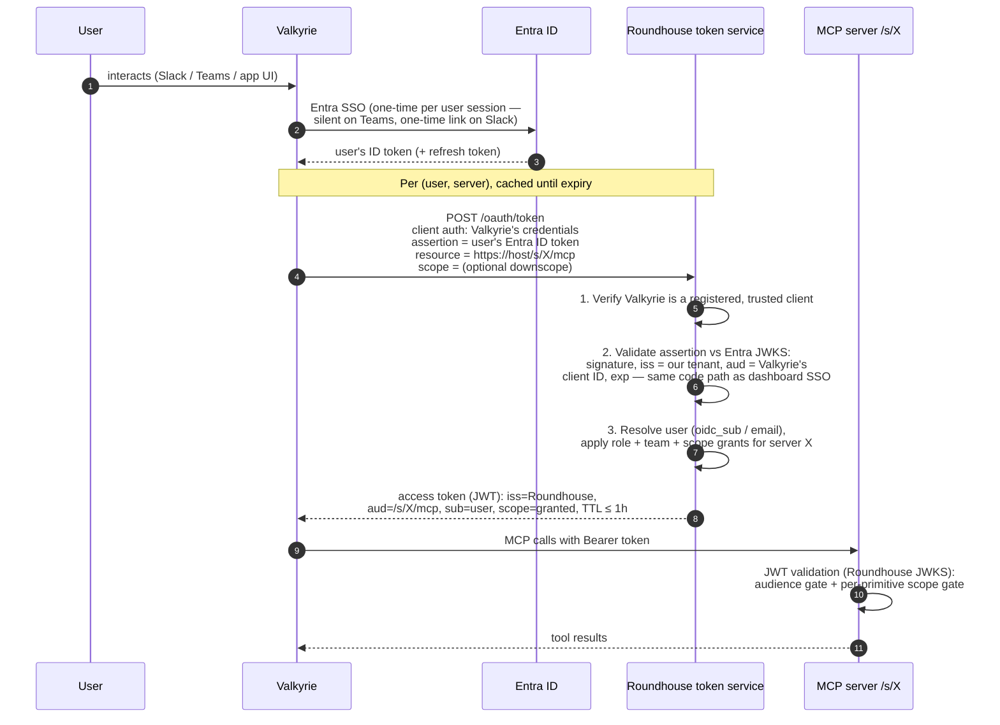
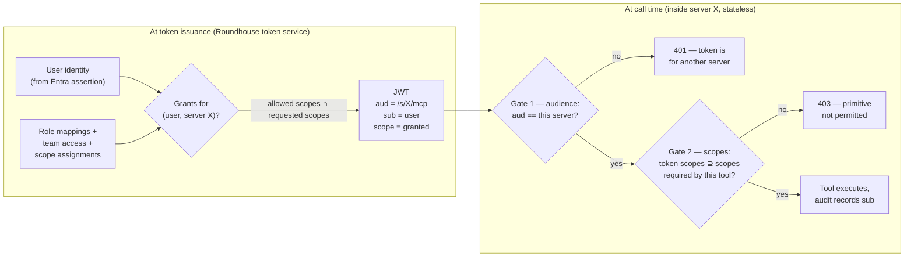

# MCP Authorization with Identity Assertions (ID-JAG) — Explainer & Design

> Status: **Design locked, build not started.** Authored 2026-07-02.
> Companion to `entra-sso-plan.md` (dashboard SSO, shipped in v0.2.0-rc line). This doc covers the
> **next** phase: OAuth for the MCP data path (`/s/{server}/mcp`), designed for the
> Valkyrie deployment model (one trusted agent app, many users, many servers).
> Written to be readable end-to-end by a non-identity audience — the ELI5 sections are
> intentionally first.

---

## 1. ELI5 — the badge-office analogy

Keep this analogy in your pocket for customer conversations. Every technical section below maps
back to it.

- **Entra ID** is the **corporate badge office**. It's the only party that can vouch for who a
  person is. Everyone already has a badge (their agency login).
- **Roundhouse** is a **secure facility** full of rooms. Each room is an MCP server. The facility
  has its own **security desk** (Roundhouse's token service) that issues room keys.
- **A room key** (an access token) opens exactly **one room** (audience) and only certain
  **cabinets inside it** (scopes — the per-tool/primitive gates).
- **Valkyrie** is a **courier** who runs errands in the facility on behalf of employees. It never
  gets a master key — it gets a short-lived, single-room key *in the employee's name* for each
  errand.

**Today (static tokens):** each room has a keypad code set when the room was built. Whoever knows
the code gets in — the room has no idea *which person* entered, the code never expires, and
handing out codes is a manual process per room.

**What we're building (interim):** the courier shows the *employee's corporate badge* at the
facility security desk. The desk verifies the badge is genuine (it can check with the badge
office's public records), looks up what that employee is allowed to touch, and issues a
30–60-minute key for the one room requested, stamped with the employee's name and their allowed
cabinets. The employee never has to walk to the facility themselves — one badge, any number of
rooms, zero extra sign-ins.

**The future standard (ID-JAG):** instead of the courier showing the raw badge, the **badge
office itself** writes a short **letter of introduction** addressed specifically to the facility:
*"The bearer (Valkyrie) is acting for employee X; our policy allows this."* The facility desk
trusts the letter and issues the same room key as before. The practical difference is
**governance**: the badge office (agency IT, in Entra) now centrally decides and logs which
couriers may visit which facilities, before anyone reaches the facility's desk. Everything at
the facility — the desk, the keys, the rooms, the cabinet rules — is unchanged.

That last sentence is the whole migration story: **we build the facility side in its final form
now, and later swap "show the badge" for "show the letter."**

---

## 2. Cast of characters

| Party | OAuth role | What it is | What it holds |
|---|---|---|---|
| End user | Resource owner | Agency staff in Slack / Teams / app UIs | Their Entra ID identity |
| **Valkyrie** | OAuth client (confidential) | Frontend conductor-agent app; runs subagents that call MCP tools on users' behalf | Its own client credentials + a per-user Entra token (after Entra login is added) |
| **Roundhouse** | Authorization server **and** host of resource servers | This platform: issues MCP access tokens *and* runs the MCP server containers | Signing keys (JWKS), user grants, role/team/scope mappings |
| Each MCP server | Resource server | A spawned FastMCP container at `/s/{name}/mcp` | Nothing secret — validates JWTs statelessly against Roundhouse's JWKS |
| Entra ID | Identity provider (IdP) | The agency's identity authority | User identities, group/app-role claims; later, ID-JAG issuance policy |

Two distinctions worth drilling, because they prevent 90% of confusion:

1. **Roundhouse wears two hats** — it *issues* tokens (authorization server) and *hosts* the
   things tokens protect (resource servers). The MCP spec explicitly allows this. Entra is never
   the issuer of MCP access tokens in any phase of this design; it is the issuer of *identity
   evidence* that Roundhouse's token service consumes.
2. **Dashboard SSO and MCP auth are separate systems.** The Entra SSO shipped for the dashboard
   (see `entra-sso-plan.md`) signs humans into the web UI. This design reuses its plumbing
   (Entra JWKS validation, claim→grant mapping) but issues a completely different kind of
   credential for a different consumer.

---

## 3. The problem we're solving

The production shape at the agency:

- A **large and growing user base** interacts with agents through Slack, Teams, and application
  UIs — not browsers pointed at Roundhouse.
- **Valkyrie** (conductor + subagents) makes the actual MCP calls. It is headless: there is no
  browser session at the moment a tool is invoked.
- **Many MCP servers, more every day.** Any flow with per-server ceremony multiplies by N and
  grows over time.

### Why the "standard" MCP OAuth flow doesn't fit

The MCP authorization spec's interactive flow (401 → discover metadata → register client →
browser redirect → consent → token) is designed for a *human at a browser* connecting an ad-hoc
client like VS Code to a single server. Applied here it would mean: every user completing an
interactive Entra sign-in **per MCP server**, brokered somehow through a Slack message. With
N servers and M users that's N×M consent ceremonies, growing daily. Non-starter — and the MCP
community knows it, which is why the identity-assertion work (§5) exists.

### Why the status quo isn't good enough either

Today the MCP data path is protected by static bearer tokens (`mcps_...`) baked into each
generated server at build time (`api/app/services/codegen.py`, FastMCP `StaticTokenVerifier`):

- **No user identity.** A token says "someone who has this string," never *who*. Per-user audit
  on tool calls — which an agency will eventually demand — is impossible.
- **No expiry.** A leaked token is valid until an admin rotates it (which triggers a rebuild).
- **All-or-nothing per token, managed by hand.** Tokens carry scopes, but they're minted
  manually per server; there is no connection to the platform's user/team/role model.
- **Shared secrets sprawl.** Valkyrie would hold one long-lived secret per server, forever.

The platform's team/owner permissions (`api/app/services/permissions.py`) currently stop at the
management API — they never reach `/s/{name}` traffic. This design is what finally extends them
to the data path.

---

## 4. Background: the MCP authorization model in 60 seconds

The MCP spec (revision 2025-11-25) builds on OAuth 2.1 and assigns fixed roles:

- An **MCP server is a resource server, never a token issuer for clients.** It advertises which
  authorization server protects it via an RFC 9728 *Protected Resource Metadata* document and a
  `WWW-Authenticate` challenge on 401.
- Tokens must be **audience-bound** (RFC 8707): a token minted for server X must be rejected by
  server Y. Forwarding a token you received onward ("token passthrough") is explicitly forbidden
  — it causes the *confused deputy* problem.
- **Scopes** carry fine-grained permission within a server; the spec's best-practice guidance is
  least-privilege, per-tool scopes — which is exactly the per-primitive gate model Roundhouse
  already has.

Everything below is an arrangement of these pieces; nothing bends the spec.

---

## 5. What ID-JAG is

**Identity Assertion Authorization Grant** — IETF draft
[`draft-ietf-oauth-identity-assertion-authz-grant`](https://datatracker.ietf.org/doc/draft-ietf-oauth-identity-assertion-authz-grant/)
(v-04, May 2026; authors from Okta and Ping Identity; originated as Okta's **Cross App Access /
XAA**; proposed for MCP as SEP-1299). It answers one question:

> How does an app that already knows who its user is (via enterprise SSO) get API access to
> *another* app's resources **for that user**, with **no user interaction**, under **centralized
> IdP policy**?

The flow has two legs:

The ID-JAG itself is a small JWT (`typ: oauth-id-jag+jwt`) whose claims are exactly the
"letter of introduction": `iss` (the IdP), `sub` (the user), `aud` (the resource app's
authorization server — Roundhouse), `client_id` (the client it was issued to — Valkyrie),
`exp`/`iat`/`jti`, and optionally `scope`.

**What makes this valuable for an enterprise:** leg 1 puts the *cross-app delegation decision*
in the IdP, where the agency's identity team lives. Which apps may reach which resources, for
which users, with step-up rules — administered and logged centrally in Entra, enforced before a
request ever reaches Roundhouse. The draft's stated design principle is that the resource's own
authorization server **remains the issuer of access tokens for its resources** — the IdP
delegates, it doesn't take over. That's why Roundhouse-as-AS (a decision we locked during SSO
planning for DCR reasons) turns out to be exactly the right architecture for ID-JAG too.

---

## 6. Why we can't implement real ID-JAG today

1. **Entra ID doesn't issue ID-JAGs yet.** Leg 1 requires the IdP to support the token-exchange
   profile and expose cross-app policy administration. Okta has shipped this (XAA); Microsoft
   has not made it generally available. We do not control that timeline.
2. **It's still an IETF draft** (individual→WG draft, v-04). Wire details could shift before RFC.
3. **MCP hasn't adopted it yet.** SEP-1299 proposes it for the MCP spec but it is not part of
   the 2025-11-25 revision.

None of these block us, because the draft cleanly separates the two legs — and leg 2 is entirely
ours to build.

---

## 7. What we're building now (the interim: "leg 2 at full fidelity")

We skip leg 1 and substitute the one Entra artifact that exists today: **the user's Entra ID
token that Valkyrie already holds after SSO login.** Valkyrie presents it directly to
Roundhouse's token endpoint as the assertion.

Key properties:

- **No user interaction per server, ever.** One Entra sign-in to Valkyrie covers every current
  and future MCP server. New servers are just new `resource` values.
- **Every tool call is attributable** to a real user (`sub` in the token → audit trail).
- **Roundhouse never sees user passwords; MCP servers never see Entra tokens.** The exchange at
  Roundhouse's desk is the boundary — the user's Entra token stops there, which is precisely the
  no-token-passthrough rule the MCP spec mandates.
- **Trust is anchored in Entra cryptography**, not in Valkyrie's honesty. Valkyrie *cannot*
  fabricate a user — it must present a genuine Entra-signed token naming that user, and
  Roundhouse verifies the signature against Entra's published keys. (We considered and rejected
  the "trusted subsystem" alternative where Roundhouse takes Valkyrie's word for the user's
  identity: it makes Valkyrie's signing key a credential that can impersonate anyone.)

### Design discipline that keeps the migration cheap

The token endpoint validates assertions through a **pluggable assertion profile** — a named
bundle of (expected issuer, expected audience, claim-mapping rules, accepted token type):

| Profile | Assertion accepted | Issuer check | Audience check |
|---|---|---|---|
| `entra-id-token` (interim) | User's Entra ID token | Entra tenant | Valkyrie's Entra client ID |
| `id-jag` (future) | ID-JAG JWT (`oauth-id-jag+jwt`) | Entra tenant | **Roundhouse's own issuer URL** |

Hardcode nothing Entra-ID-token-specific into the endpoint logic; "interim mode" and "ID-JAG
mode" are two rows in this table, and both can be enabled simultaneously during a migration.

### Valkyrie's side (new work, outside this repo)

- Register Valkyrie as an Entra app; implement OIDC login.
  - **Teams:** Teams identity *is* Entra identity — tab/bot SSO yields a token silently, no
    visible login.
  - **Slack:** one-time "link your account" browser hop per user; Valkyrie stores the refresh
    token and the user never sees a login again.
- Register Valkyrie with Roundhouse as a confidential client (one manual registration — no DCR
  needed on this path).
- Cache exchanged tokens per (user, server); re-exchange on expiry. Refresh the user's Entra
  token via the refresh token as needed.

### The interactive flow still exists — for a different audience

Ad-hoc clients (VS Code, Claude Desktop, an engineer testing a server) still get the standard
spec flow: 401 → Protected Resource Metadata → DCR/CIMD registration → browser → Entra → token.
Same Roundhouse authorization server, same issued-token format, different grant type in the
front door. Token exchange is for **trusted, pre-registered app clients**; the interactive flow
is for **humans with browsers**. They coexist.

---

## 8. Migration to real ID-JAG (when Entra ships it)

Exactly two changes, both small:

| Where | Change |
|---|---|
| **Valkyrie** | Add one call: exchange the user's token *at Entra* first (leg 1), then send Roundhouse the returned ID-JAG instead of the raw ID token. The call to Roundhouse doesn't change shape — same endpoint, same JWT-bearer grant, different assertion in the same field. |
| **Roundhouse** | Enable the `id-jag` assertion profile: accept `typ: oauth-id-jag+jwt`, check `aud` = Roundhouse's issuer (instead of Valkyrie's client ID), verify the embedded `client_id` matches the authenticated client, honor the grant's `scope` as an upper bound. Validation-rule swap, not an architecture change. |
| **Agency IT** | *Gains* the ability to administer which apps reach which resources centrally in Entra, with IdP-side logging — the governance win that motivates the standard. |

**What does not change:** the token endpoint, the issued MCP access tokens, audience binding,
scope enforcement in every generated server, Valkyrie's caching, the audit trail, the
interactive flow for ad-hoc clients. Run both assertion profiles in parallel during cutover;
disable `entra-id-token` when Valkyrie has fully switched.

If the IETF draft shifts details before RFC, the blast radius is the same as the migration
itself: one profile's validation rules.

---

## 9. How the primitive gates work (scopes, audiences, tokens)

Roundhouse today enforces **per-tool/prompt/resource scope requirements** inside each generated
server: a middleware checks the caller's scopes against each primitive's required scopes (AND
semantics), with `deny_unlisted` controlling primitives that declare no scopes. **This entire
layer survives unchanged.** What changes is only *where the caller's scopes come from*.

Two gates, two questions:

- **Audience** (new, per-token): *may this token be used at server X at all?* A token for
  server X presented to server Y fails signature-independent audience validation — a compromised
  or malicious server can't replay its callers' tokens against its neighbors.
- **Scopes** (existing mechanism, new source): *which of X's primitives may this user touch?*
  Previously read from the static token→scope map baked at build time; now read from the
  validated JWT's `scope` claim. Same middleware, same semantics, same `ServerScope`
  definitions.

### The one genuinely new policy surface: scope-aware grants

Today "can user U access server X" is binary (owner / teammate / superadmin). The token service
needs a finer answer: *which scopes* does U get on X. The natural extension of the existing
two-section role-mapping model (built-in roles + team access) is a third dimension: each grant
optionally carries a scope set per server (default: all scopes, preserving current behavior).
The token endpoint issues **the intersection of what the client requested and what the user's
grants allow** — so Valkyrie can also *downscope*, requesting only the scopes a given agent task
needs even when the user is entitled to more.

### Answering the motivating question directly

> *A user might need access to only some of an MCP server's primitives — does that still work?*

Yes, and better than today: the restriction is now **per user** (derived from their roles/teams
at issuance) rather than per shared static token, it's enforced by the same in-server middleware
that does it now, and every allow/deny decision is attributable to a named user.

### Coexistence and revocation

- **Static `mcps_` tokens keep working during migration.** Both verifier types can be active in
  a generated server simultaneously (both feed the same scope middleware); retire static tokens
  server-by-server once JWT clients are proven.
- **Revocation = short TTL.** Access tokens live ≤ 1 hour and servers validate statelessly (no
  per-call callback to the platform — deliberately, so the platform API stays off the data path
  and can't take tool-calling down with it). Disable a user in Entra or cut their grants in
  Roundhouse, and their access dies at the next exchange — worst case one TTL later. If the
  agency needs faster-than-TTL kill, shorten the TTL before reaching for token-introspection
  callbacks.

---

## 10. Build inventory (what this actually costs)

**Roundhouse (this repo):**

1. Authorization-server core: RFC 8414 metadata + JWKS endpoint, `/oauth/token` with the
   JWT-bearer/token-exchange grant and pluggable assertion profiles; signing keys managed via
   the existing `app.crypto` envelope (`APP_KEY`).
2. Interactive flow for ad-hoc clients: `/oauth/authorize` (reusing the shipped Entra SSO flow
   for the login leg), DCR (`/register`, policy-gated) and/or CIMD, RFC 9728 Protected Resource
   Metadata per server + 401 `WWW-Authenticate` challenge.
3. Codegen: emit FastMCP JWT verification (issuer = Roundhouse, audience = `/s/{name}/mcp`,
   JWKS URL) alongside — later instead of — `StaticTokenVerifier`.
4. Grants: scope-aware role/team access (schema + the third column in the existing SSO
   settings UI).
5. Audit: record `sub` on tool-call logs.

**Valkyrie (separate repo/team):** Entra OIDC login (Teams SSO + Slack link flow), Roundhouse
client registration, token exchange + per-(user, server) cache.

**Later (Entra-dependent):** flip on the `id-jag` profile; agency IT configures cross-app policy
in Entra.

---

## 11. Customer-conversation FAQ

**"Do my users have to log in to every MCP server?"**
No. One sign-in to Valkyrie (invisible on Teams). After that, access to every server they're
entitled to is automatic — including servers deployed after they signed in.

**"What happens when someone leaves or changes roles?"**
Disable them in Entra (or change their groups): every new token exchange fails or reflects the
new roles immediately; existing tokens expire within the hour. No per-server cleanup.

**"Who decides what a user can do?"**
Roundhouse admins, in the same role-mapping UI used for dashboard SSO — down to individual tools
on individual servers. When Entra ships ID-JAG support, agency IT additionally gets a central
switch in Entra for which *applications* may reach Roundhouse at all.

**"Is this standards-based or homegrown?"**
Standards-based end to end: OAuth 2.1, RFC 7523 (JWT-bearer), RFC 8693 (token exchange),
RFC 8707 (audience binding), RFC 9728 (resource metadata), per the MCP authorization spec
(2025-11-25). The one forward-looking piece tracks an active IETF draft (ID-JAG) that we're
positioned to adopt with a config-level change when Microsoft supports it.

**"Can one compromised MCP server endanger the others?"**
No. Tokens are audience-bound to a single server; server Y rejects tokens minted for server X.

**"What does a tool call look like in the audit log?"**
User, server, tool, scopes, timestamp — because every token names the human it was issued for.
Today's static tokens can only say "someone with the key."

---

## 12. References

- MCP Authorization spec (current): <https://modelcontextprotocol.io/specification/2025-11-25/basic/authorization>
- MCP Security Best Practices: <https://modelcontextprotocol.io/specification/2025-11-25/basic/security_best_practices>
- MCP authorization tutorial (conceptual walkthrough, Keycloak lab): <https://modelcontextprotocol.io/docs/tutorials/security/authorization>
- ID-JAG draft: <https://datatracker.ietf.org/doc/draft-ietf-oauth-identity-assertion-authz-grant/>
- SEP-1299 (ID-JAG for MCP): <https://github.com/modelcontextprotocol/modelcontextprotocol/issues/1299>
- Okta Cross App Access (XAA) announcement: <https://www.okta.com/newsroom/press-releases/okta-introduces-cross-app-access-to-help-secure-ai-agents-in-the/>
- RFC 8693 (Token Exchange), RFC 7523 (JWT-bearer), RFC 8707 (Resource Indicators), RFC 9728 (Protected Resource Metadata), RFC 8414 (AS Metadata), RFC 7591 (DCR)
- In-repo: `entra-sso-plan.md` (dashboard SSO, Phase 1 — shipped), `api/app/services/codegen.py`
  (current static-token enforcement), `api/app/services/permissions.py` (current access model)
