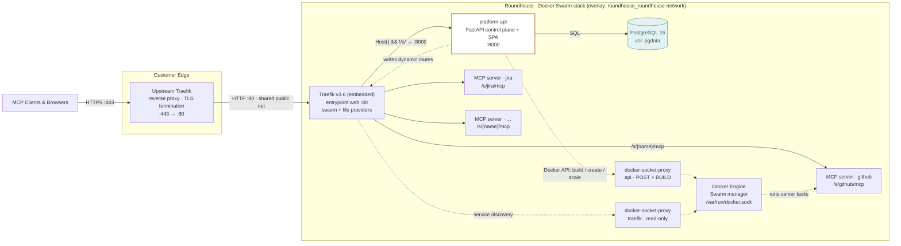

# Roundhouse — Architecture (Docker Swarm)

Self-hosted MCP server hosting on Docker Swarm, fronted by the customer's edge Traefik.
TLS is terminated at the edge; the embedded Traefik speaks HTTP only.

### Traffic flow
1. **Client → edge.** Client hits `https://roundhouse.example.com`; the upstream Traefik terminates TLS at `:443`.
2. **Edge → embedded Traefik.** Forwards plain HTTP to the stack's Traefik `:80` over the shared `public` overlay network.
3. **UI/API.** `Host(…) && !PathPrefix(/s/)` routes to `platform-api:8000`.
4. **MCP traffic.** `/s/{name}/mcp` routes straight to the matching MCP server service.
5. **Provisioning.** platform-api builds images and creates/scales MCP services via the scoped socket-proxy (POST+BUILD).
6. **Discovery & state.** Embedded Traefik discovers services via the read-only socket-proxy; platform-api stores metadata in Postgres and writes dynamic routes to a shared volume.
